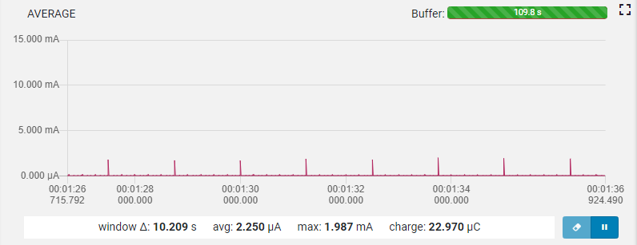
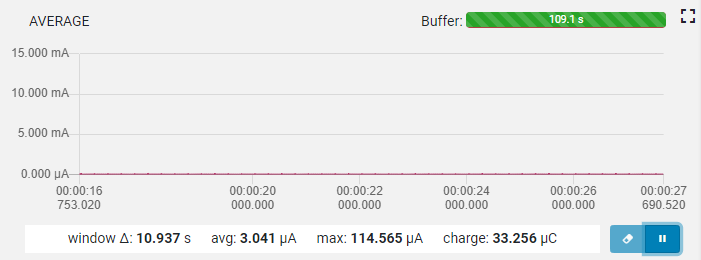
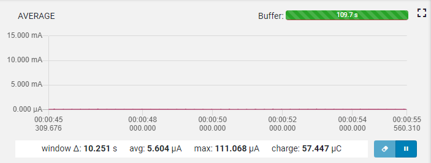

saadc_low_power example
==================

 This project contains code examples that shows various nRF52 SAADC functionality and low power operation.
 
Requirements
------------
- nRF5 SDK version 17.0.0
- nRF52-DK/nRF52840-DK

To compile it, clone the repository in the \nRF5_SDK_17.0.0_9d13099\examples\peripheral\ folder. If you download the zip, place the saadc_low_power folder into the \nRF5_SDK_17.0.0_9d13099\examples\peripheral\ folder.

Documentation
-----------------
- Perhipheral: nRF52 SAADC
- Compatibility: nRF52832 rev. 1 and 2/nRF52840 rev. 1 and 2, nRF5 SDK 17.0.0
- Softdevice used: No softdevice
  
This example enables the RTC timer to periodically trigger SAADC sampling. RTC is chosen here instead of TIMER because it is low power. The example samples on a single input pin, the AIN0, which maps to physical pin P0.02 on the nRF52832/nRF52840 ICs.

This example is optimized for minimal current consumption, and consumes about ~2.3uA on nRF52832, ~3.0uA on nRF52833, and ~5.1uA on nRF52840, when compiled without any modification. One of the reasons for higher current consumption on nRF52840 is increase RAM size, which is retained during System ON sleep mode. Unused RAM sections can be disabled in the application (https://infocenter.nordicsemi.com/topic/ps_nrf52840/power.html#ram_sections).

This SAADC example shows the following features:
- **Low Power ->**    
    1) The low-power mode in the SAADC driver will trigger START task right before sampling, instead of when buffers are setup using nrf_drv_saadc_sample_convert(). This will enable EasyDMA only during sampling, but leave it disabled when not sampling. The EasyDMA consumes around 1.5mA when enabled.    
    2) Low power can only be obtained when UART is disabled. UART will add between 50-600uA current consumption, depending on TX/RX configuration.  
    3) Enable DCDC converter at startup with `NRF_POWER->DCDCEN = 1;`  
    4) Use RTC instead of TIMER periperal. That will save ~300uA.
- **Oversampling ->** This reduces SAADC noise level, especially for higher SAADC resolutions, see https://devzone.nordicsemi.com/f/nordic-q-a/14583/nrf52832-saadc-sampling/55670#55670 . Configured with the SAADC_OVERSAMPLE constant.
- **BURST mode ->** Burst mode can be combined with oversampling, which makes the SAADC sample all oversamples as fast as it can with one SAMPLE task trigger. Set the SAADC_BURST_MODE constant to enable BURST mode.
- **Offset Calibration ->** SAADC needs to be occasionally calibrated. The desired calibration interval depends on the expected temperature change rate, see the nRF52832 PS/nRF52840 PS for more information. The calibration interval can be adjusted with configuring the SAADC_CALIBRATION_INTERVAL constant.

The SAADC sample result is printed on UART using the NRF_LOG module, if NRF_LOG_ENABLED is set in the sdk_config.h gile. To see the UART output, a UART terminal (e.g. Realterm or Termite) can be configured on your PC with the UART configuration set in the uart_config function, which is also described in the SAADC example documentation -> https://infocenter.nordicsemi.com/topic/sdk_nrf5_v17.0.0/nrf_dev_saadc_example.html
  
Indicators on the nRF52-DK/nRF52840-DK board:
- LED1: SAADC Sampling triggered 
- LED2: SAADC sampling buffer full and event received
- LED3: SAADC Offset calibration complete

In order to trigger the **offset calibration** task, the SAADC driver needs to be in IDLE mode. This is achieved by calling the abort task, which will abort all ongoing conversions. A flag is set to trigger the **offset calibration** task in the main context, when the driver have entered IDLE state. When calibration is done, the SAADC throws a "calibration done" event. When calibration is done, both buffers need to be setup for conversion again to keep double-buffering, since they were removed by the abort task. The table below shows how long it typically takes to calibrate the SAADC for different acquisition time setting.

Acquisition time | Start cal until end cal | Start cal until SAADC ready
--------- | --------- | ---------
**3 us** | 102 us | 118 us
**10 us** | 279 us | 314 us
**40 us** | 988 us | 1152 us

About this project
------------------
This application is one of several applications that has been built by the support team at Nordic Semiconductor, as a demo of some particular feature or use case. It has not necessarily been thoroughly tested, so there might be unknown issues. It is hence provided as-is, without any warranty. 

However, in the hope that it still may be useful also for others than the ones we initially wrote it for, we've chosen to distribute it here on GitHub. 

The application is built to be used with the official nRF5 SDK, that can be downloaded from http://developer.nordicsemi.com/

Please post any questions about this project on https://devzone.nordicsemi.com.
